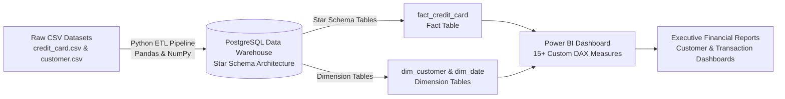

# Credit Card Financial Portfolio & Risk Analytics
**Author:** [Yogesh Birla](https://github.com/yogs011)  
**Core Stack:** `Power BI`, `DAX`, `Pandas`, `NumPy`, `EDA`, `Star Schema Modeling`, `ETL`, `SQL (PostgreSQL)`

---

## 📌 Project Architecture & Overview
Architected an end-to-end financial analytics pipeline for **10,000+ credit card accounts** and **$55M+ in transaction volume**, performing data cleansing, normalization, and Star Schema data modeling across transaction and demographic data.



---

## 🚀 Key Highlights & Portfolio Capabilities

### 1. End-to-End ETL Pipeline (Pandas & NumPy)
- **Extract**: Ingested **10,293 account records** across primary and Week-53 supplementary data files (`credit_card.csv`, `customer.csv`, `cc_add.csv`, `cust_add.csv`).
- **Transform**: Automated data cleansing, whitespace trimming, date formatting (`ISO/DMY`), datatype casting, and feature engineering (Revenue = Annual Fees + Transaction Spend + Interest).
- **Load**: Normalized data into clean relational data structures for database ingestion and BI reporting.
- *Pipeline Code:* [`credit_card_analysis.py`](./credit_card_analysis.py).

### 2. Star Schema Data Modeling (SQL & Data Warehousing)
- Modeled a Star Schema architecture separating transactional facts from business dimensions:
  - **Fact Table:** `fact_credit_card` (Revenue, Revolving Balances, Utilization Ratio, Delinquency Status, Fees).
  - **Dimension Tables:** `dim_customer` (Age, Gender, Education, Income, Job) and `dim_date` (Week Number, Quarter, Year, Month).
  - Configured foreign key relationships and performance indexes (`Client_Num`, `Date_Key`).
- *SQL Scripts:* [`star_schema_data_model.sql`](./star_schema_data_model.sql).

### 3. Exploratory Data Analysis (EDA)
- Conducted deep exploratory analysis profiling portfolio spend patterns, credit limits, and delinquency distributions across customer demographics.
- Generated automated high-resolution KPI charts and spend channel breakdowns (Chip, Swipe, Online).
- *Interactive Notebook:* [`credit_card_analysis.ipynb`](./credit_card_analysis.ipynb).

### 4. Power BI & 15+ Custom DAX Measures
- Engineered **15+ custom DAX measures** in Power BI Desktop to power executive dashboards:
  - **Time Intelligence & Growth:** `[Current_Week_Revenue]`, `[Previous_Week_Revenue]`, `[WoW_Revenue_Growth]`, `[YoY_Revenue_Growth]`, `[Four_Week_Moving_Average_Revenue]`.
  - **Revenue & Financial KPIs:** `[Total_Revenue]`, `[Total_Interest_Earned]`, `[Total_Annual_Fees]`, `[ARPU]`, `[Avg_Transaction_Size]`.
  - **Risk & Delinquency Metrics:** `[Delinquency_Rate]`, `[Delinquent_Accounts_Count]`, `[Avg_Credit_Utilization]`, `[Avg_Revolving_Balance]`.
- *DAX Source Code:* [`dax_measures.dax`](./dax_measures.dax).
- *Dashboard PDF Exports:*
  - [`Credit Card Financial Dashboard-Customer.pdf`](./Credit%20Card%20Financial%20Dashboard-Customer.pdf)
  - [`Credit Card Financial Dashboard-Transaction.pdf`](./Credit%20Card%20Financial%20Dashboard-Transaction.pdf)

---

## 📊 Portfolio KPI Summary

```text
============================================================
          EXECUTIVE PORTFOLIO KPI SUMMARY
============================================================
 Total Active Accounts          : 10,293
 Total Transaction Volume ($)   : $45,533,021.00
 Total Annual Fees Collected ($): $3,001,510.00
 Total Interest Earned ($)      : $7,982,479.81
 Total Combined Portfolio Volume: $56,517,010.81
 Average Revenue Per User (ARPU): $5,490.82
 Portfolio Delinquency Rate     : 6.06%
 Average Credit Utilization     : 27.45%
 Average Credit Limit           : $8,642.41
============================================================
```

---

## 🛠️ Quickstart Guide

### 1. Setup Environment & Run ETL Pipeline
```bash
# Clone repository
git clone https://github.com/yogs011/citi-credit-card-portfolio-analytics.git
cd citi-credit-card-portfolio-analytics

# Create and activate virtual environment
python -m venv .venv
.venv\Scripts\activate   # Windows

# Install dependencies
pip install -r requirements.txt

# Run Python ETL & EDA pipeline
python credit_card_analysis.py
```

### 2. View Jupyter Notebook
```bash
jupyter notebook credit_card_analysis.ipynb
```

### 3. Deploy SQL Star Schema
Execute [`star_schema_data_model.sql`](./star_schema_data_model.sql) in PostgreSQL / pgAdmin to initialize tables and load data.
