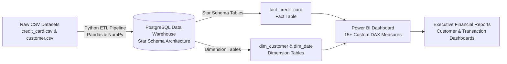

# Credit Card Financial Portfolio & Risk Analytics
**Author:** [Yogesh Birla](https://github.com/yogs011)  
**Core Stack:** `Power BI`, `DAX`, `Pandas`, `NumPy`, `EDA`, `Star Schema Modeling`, `ETL`, `SQL (PostgreSQL)`

---

## Project Architecture And Overview
Architected an end-to-end financial analytics pipeline for **10,000+ credit card accounts** and **$55M+ in transaction volume**, performing data cleansing, normalization, and Star Schema data modeling across transaction and demographic data.

---

